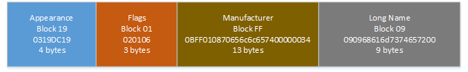

# DC25 Bluetooth Protocol

So you might have noticed that multiple badges talked to each other this year.  How did we do that?  Well, the magic is in the BLE advertising packet.

This packet can be up to 31 bytes long, and consists of a series of 'blocks'.  Each block starts with a byte that indicates how many bytes follow in this block, next byte is the block type, then the rest of the bytes are the block content.

The key parts of the DC25 protocol are the Appearance value, which must be DC19, and the manufacturer block, which defines which badge this is.  The rest of the packet can be whatever you want it to be.

Here's a visual of a packet that my DC801 badge broadcasted:

Let's break this down:

General notes:  This is the order the DC801 badge sent the blocks, but in reality the order doesn't matter.

First off, Appearance. 4 total bytes, but the length byte doesn't count, so 03 bytes long.  Type is 0x19 to indicate this is a BLE Appearance block, then the Appearance ID of DC19

Next up, Flags.  The Flags mark what kind of advertisement this is.  With our flags of 06 we indicate we are general connectable and that we'll show up in bluetooth scans.  Open your phone and look for nearby devices - your DC801 badge will show up there.  We don't offer any actual services, so connecting to the badge is a bit of a honeypit to slow down people attempting to figure out the game protocol.

Next block, Manufacturer.  This block is a little special.  The first two bytes is the manufacturer ID, which is byte swapped 'on the wire' as it were: 0108 is 0801.  Some groups actually registered with the BLE group and got a real ID - check out Bender or Queercon.  We didn't get the paperwork done in time, so we used a fake ID that was not in use for 0801.  Now, there are some bytes that follow.  Those bytes can be any length (up to the 31 total, remember), and can mean anything you want them to mean.  In our case:

0108 - DC801 is the manufacturer
70656c6c65740000 - ASCII string, your offensive vector - mine is pellet.  It is always 8 chars, if less, it is padded
0034 - The 00 is ignored on user badges, and the 34 is the random number you are broadcasting for the game.

If the OV is HELGABAH, then the 0034 is treated as a command from one of the master badges.  Two commands are defined: reset badge, and party mode:

* 0011 - Reset badge at next boot - useful for resetting a room of defaults to try to normalize the game
* 0142 - Enable party mode - Flashes the LEDs and shows PARTY on the screen, we had a few masters at the party to do this

Last block is a type 09, which is the Long Name.  This part of the BLE stack will show up as the name if you scan for a device.  Again, it's 8 chars, always, padded with 00 if shorter.  Other badges didn't even look at this, it was just for showing up in bluetooth scans.  68616d7374657200 is ASCII 'hamster'.

## The Game

So how did the game work?

At bootup and each time the game is played, a random 8 bit number is generated.  This is added a min time define, which was 500 seconds.  A counter ticks this down, and once it hits zero, the game is played again.

Each time the images cycled through, a new random number is generated for the OV broadcast.  Once the game play function is run, that number is held, and compared against whatever the last badge broadcast we received was, and if ours is lower, we lose.  If we lose, we generated another number.  If it was below 200, we would then swap our OV to whatever that other badge was broadcasting - this was so that if someone figured it out and always sent 255, there was always a chance that you wouldn't lose to them.

After all that, an image is shown win or lose, then back to the normal shout-out cycle.

Master badges did not play the game, they always kept their vector.  This was to try to normalize the game away from the default value, for people that refused to set a vector.  The default was \_Helga\_.  I'm also told some people ended up with \_Helga\_ when they turned on the badge - it could be possible there was some flash corruption or a race condition on reading the flash there.  Ooops!

How did the game work for you?  Let me know!  [@hamster](http://twitter.com/hamster)

